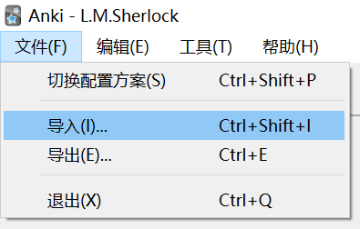
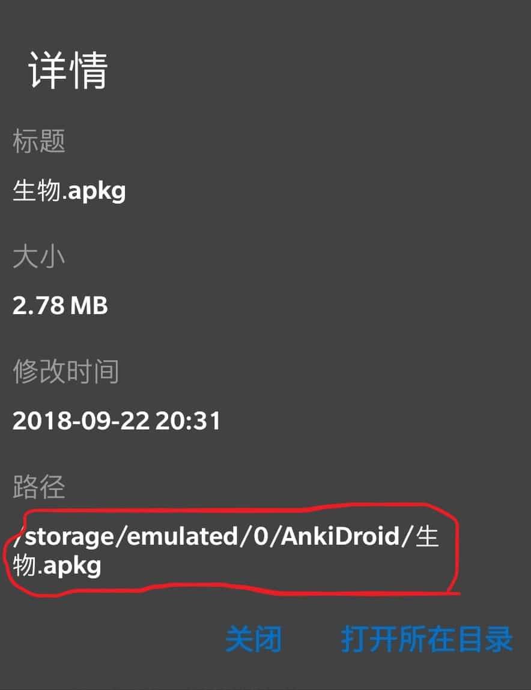
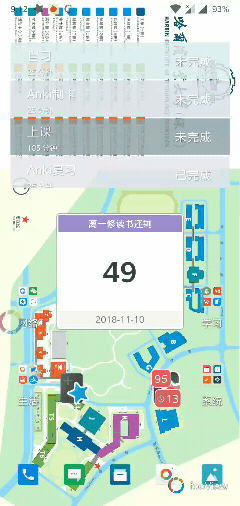
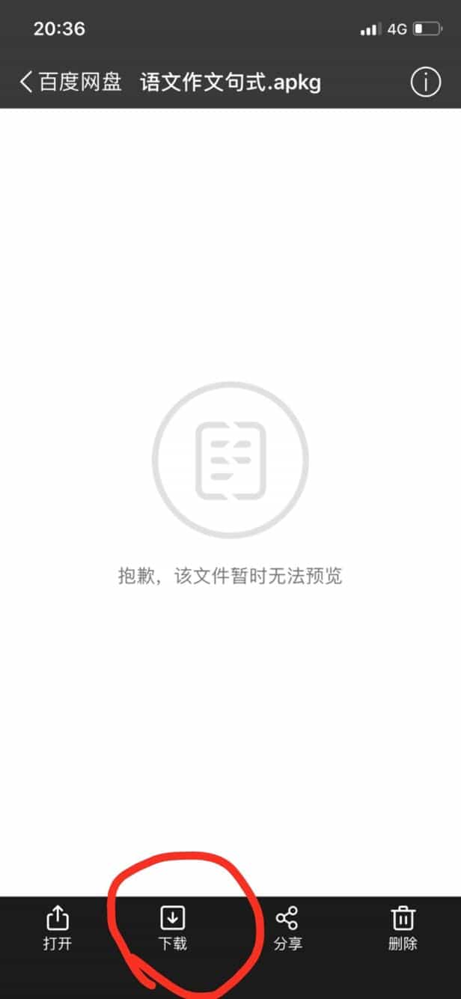
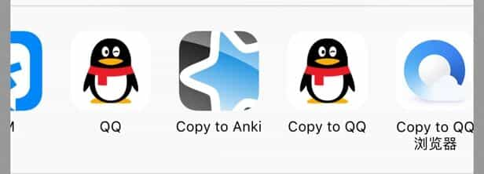

> .apkg 文件（「牌组/记忆库」）在各系统的打开方法
[TOC=2,4]
「牌组/记忆库」即「卡片」的集合，用于分类储存「卡片」。
试用材料请用百度云下载

>[warning] 点击下面的链接即可
> **注意**，这会导致转跳到本书之外的网站
> https://pan.baidu.com/s/1dA5jpF4PoyIlnAG2Z3m0PQ

## 3.1.1 Windows/Mac

:-: 

如图所示，只要你安装好 Anki，.apkg 文件就会自动关联好，只要双击打开，就可以导入了。

:-: 

如果不行的话，就像上图所示，手动导入。

## 3.1.2 Android

首先，由于 AnkiDroid 不能关联 .apkg 文件，所以你是**无法直接打开**下载下来的牌组的！

那该怎么导入卡片呢？

我们得曲线救国，即手动导入卡片。

在这之前，我们需要把下载下来的文件移动到指定路径。

怎么移动文件？你得先找到下载的 .apkg 文件

先点击系统自带的文件管理

搜索 .apkg

如果你下载前面的牌组，你就可以找到下图的文件了

:-:  

你只需要把 .apkg 文件复制或移动到下图的路径即可

:-: 

然后就可以打开 AnkiDroid 进行导入操作

具体过程如下图

:-: 

## 3.1.3 iOS

打开百度云

:-: 下载

:-: 打开

:-: 如果有 Copy  to Anki 就直接点

:-: 如果没有，可能藏在 More 里面

