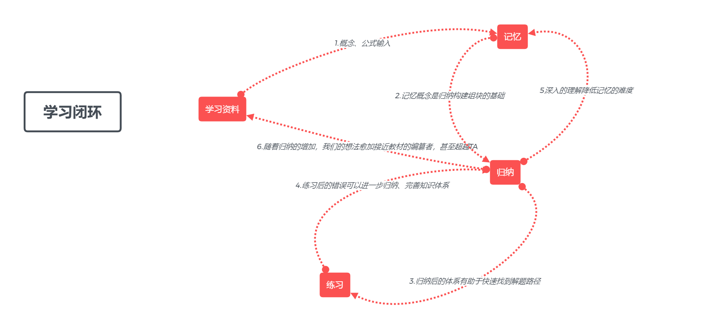

# 5.1 学习闭环
> 你的开环学习很可能是假学习

## 5.1.1 小类比

先做一个简单的类比

很久很久以前，在一个热带荒岛上，有一个遭遇海难的倒霉蛋在使劲种田，麻雀来啄嫩芽时发现没有稻草人，暴雨来临时发现没有棚屋，丰收时发现没有仓库。随着时间流逝，在高温和潮湿的作用下，粮食很快发霉腐烂，无法食用。

真正要在荒岛上生存，应当像鲁滨逊那样，一边种粮一边修地窖和棚屋、编藤篮和稻草人。待到丰收日，计算来年的种子和余粮数量，做到未雨绸缪、合理规划。

学习也像荒岛生存。如果一味的刷题，没有抽出归纳知识和记忆知识的时间，就像第一个倒霉蛋那样，学到的知识很快就归零了。没有计划则会导致对高考的备考没有时间观念，将过多时间花在某一个模块上，最后时间紧张，自己也对高考没底。

唯有像鲁滨逊那样，我们才能将学过的完好地知识储存到高考那天。而且，有条理的复习可以加强信心，设定合理的目标。

好吧，这些和开环学习还有闭环学习有什么关系吗？？？

没关系吗？第一个倒霉蛋每次种田只能维持一段时间的口粮。没有多少余粮能够留到下一次生产周期。这可谓**开环**，因为每次的生产都是出清的，种的太多吃不完也只能扔掉，烂掉的粮食也没法吃。虽然很辛苦，却只能勉强维持一下生存。

鲁滨逊则不仅养活自己，还有3-5年的存粮，遇上野蛮人打战，也能暂时放下生产计划，积极应战。甚至还能教授其他海难的船员一起高效生产。每次的余粮都能投入到下次扩大生产，这不就是**闭环**么？

那么，学习闭环究竟该如何实现呢？

## 5.1.2 学习闭环

1.从学习资料输入概念和公式等基础知识

2.通过记忆基础知识，为归纳出模型铺路

3.搭建初步的知识体系，可以拓宽解题思路

4.解题检验出知识漏洞并提供更多知识模型以供归纳

5.归纳后的知识得到内化，加深理解，记忆更加牢固

6.不断地在学习闭环中循环提升，最终超过教材的境界

