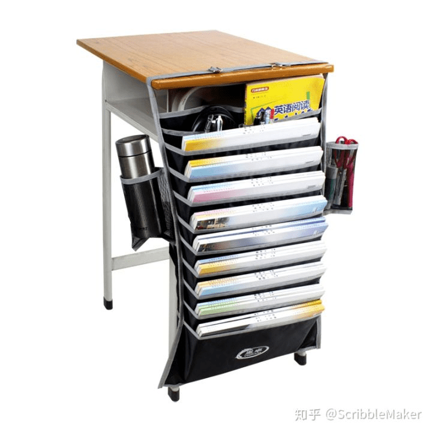
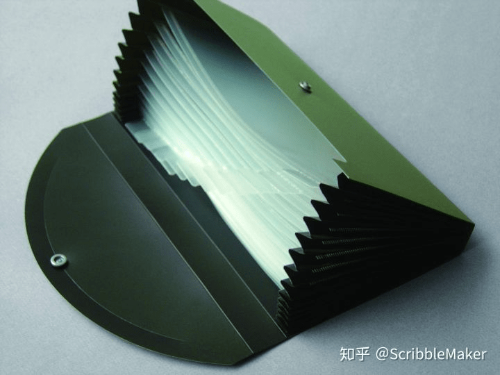

> 整理好材料也是高效学习的一部分
[TOC=2,3]
Anki 制卡的最大来源就是学习材料（废话）

所以，高效地整理学习材料，能让我们事半功倍

就让我与大家分享一下，我的学习材料整理方法吧！

## 分类标准

**待完成**、**待批改**、**待订正**、**待复盘**、**待制卡**、**已利用**

## 术语讲解

待完成：顾名思义，老师或你自己计划要做的练习，但还没开始动笔；

待批改：准备交给老师或者自己批改；

待订正：批改完后还没有订正；

待复盘：复盘是围棋术语，在这里，我指的是对订正完毕的材料进行深入思考，找出自己出错的原因（这里要结合做作业时的状态），归纳反思这份材料给我们带来了哪些知识；

待制卡：这里就是与 Anki 结合的地方，将我们复盘后归纳反思出来的认识通过制卡的方式，用于今后的复习；

已利用：这份材料的价值已经被我们抽干了，可以拿去垫桌脚了（笑）

## 可能用到的材料

:-: 
挂书袋
提高书桌空间神器！

:-: 
风琴包
容量大，可按多种标准分类文件
*****
## 具体操作

每天老师和自己计划的学习材料，按照**重要程度**，放进待完成的位置（比记作业效果好）

做完的作业放进待批改，继续处理未完成的作业

垃圾时间（学不动了）的时候可以用于解决待批改的作业（反正就对个答案，很养生）

一般来说，在晚上抽出**大段时间**来解决待复盘的材料（白天上课记的笔记也可以拿出来用）（切记，复盘的材料要**新鲜**，不要拖太久）

这里说明一下，题是**做不完的**，好好利用做过的题很重要（用了这个整理方法你就知道每天你的**最大处理量**是多少了）

然后把今天总结的知识做成卡片，这些材料就完成了使命，可以找个地方存起来了
*****
Q：为什么不按科目来分类呢？

A：这样做我会经常忘记有些材料还没有做成卡片，就被淹没在了文件海中，而且很多材料你不会拿出来用第二次。不如用我的方法，这样序列中的材料总量不会太大，找起来也很方便

Q：作业做不完，待完成的材料积累太多，怎么办？

A：很简单，少做点。特别是性价比很低的作业。还可以做一些综合题，达到同时训练多个能力的效果（比如做英语完形填空，同时还可以练阅读理解，所以平时我都是只刷完形填空的）

